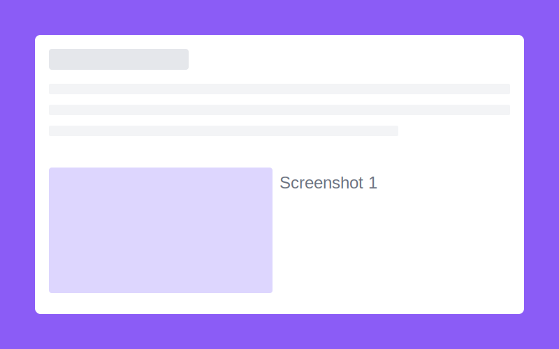
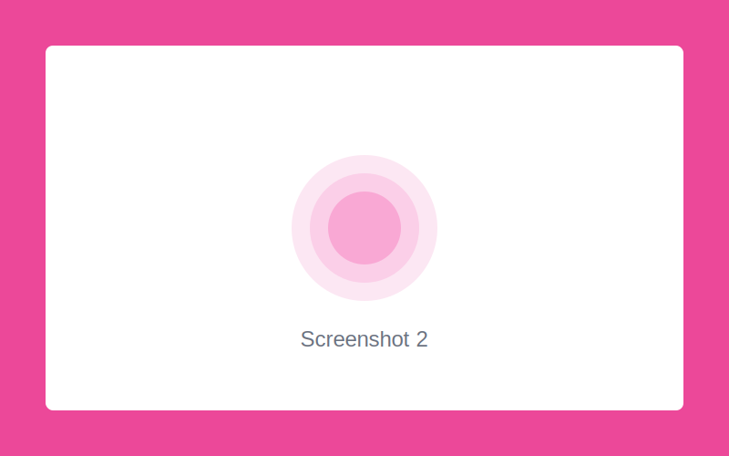

## 개요

이제 블로그 포스트를 작성할 때 이미지를 같은 폴더 안에서 관리할 수 있습니다! 더 이상 public 폴더에 이미지를 넣을 필요가 없습니다.

## 폴더 구조

새로운 블로그 포스트 구조는 다음과 같습니다:

```
contents/blog/posts/
└── example-post/
    ├── content.mdx          # 메인 콘텐츠
    ├── hero-image.png       # 히어로 이미지
    ├── screenshot1.png      # 스크린샷
    └── diagram.svg          # 다이어그램
```

## 이미지 사용하기

### 기본 사용법

같은 폴더에 있는 이미지는 파일명만으로 참조할 수 있습니다:


### 여러 이미지 나열





## 코드 하이라이팅

물론 코드 블록도 잘 작동합니다:

```typescript
export function getBlogPosts(): BlogPost[] {
  const postsDir = path.join(process.cwd(), 'contents', 'blog', 'posts')

  return entries.map((entry) => {
    // 폴더 구조 지원
    if (stat.isDirectory()) {
      const contentPath = path.join(entryPath, 'content.mdx')
      // ...
    }
  })
}
```

## 장점

1. **정리가 쉽다**: 포스트와 관련된 모든 파일이 한 곳에 있습니다
2. **이동이 편하다**: 폴더 전체를 이동하면 됩니다
3. **관리가 간편하다**: 포스트 삭제 시 폴더만 삭제하면 됩니다

## 외부 이미지도 지원

물론 외부 이미지 URL도 그대로 작동합니다:


## 마무리

이제 블로그를 더 쉽게 관리할 수 있습니다! 🎉
