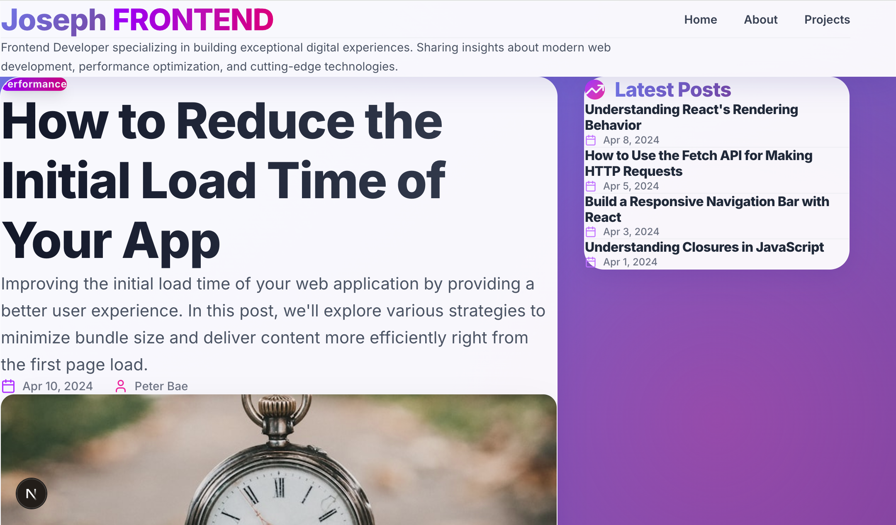

4년간의 개발생활 이제는 블로그가 필요하다는 생각이 들었다. 모든 개발자의 꿈이자 시작점 개인 블로그, 시작하자니 개발하기 귀찮고,
안하자니 가오가 상하는 그것...

이제는 더이상 미룰수 없다. 오른팔에 GPT, 왼팔에 claude code를 부여잡고 모든 과정을 바이브하게 만들기 시작했다!

## 바이브 코딩의 시작

시작은 친구의 블로그를 구경하며 시작되었다. 깔끔한 UI에 완성도있는 기능은 나에게 적잖은 충격으로 다가왔다. 우선 첫번째로 한것은
claude code의 mcp서버 설정이었다. context7과 내 데스크탑의 접근을 허용해서 AI가 코딩할 수 있는 환경을 조성해 주었다.

```
 "mcpServers": {
    "youtube-transcript": {
      "command": "npx",
      "args": [
        "-y",
        "@kimtaeyoon83/mcp-server-youtube-transcript"
      ]
    },
    "context7": {
      "command": "npx",
      "args": [
        "-y",
        "@upstash/context7-mcp@latest"
      ]
    },
    "filesystem": {
      "command": "npx",
      "args": [
        "-y",
        "@modelcontextprotocol/server-filesystem",
        "/Users/josephkim"
      ]
    }
  }

```

## AI가 제대로 개발 할 수 있게 방향성을 제시하기

처음에는 프롬프트를 무식하게 작성했었다. ~~ 할거니까 ~~ 해줘 등의 램프의 요정에게나 할 법한 프롬프트가 아닌, 그냥 부탁을 한것이다.
AI에게 제대로 일을 시키기 위해서는 방향성을 제시하고, 내가 원하는 해결법을 알려주어 정확한 결과가 나오게해야한 다는 것을 깨달을 수 있는 경험이었다.


아무런 대안없이 뽑힌 첫번째 블로그... 처참하다.

그래서 vercel의 템플릿에서 디벨롭하는 방향으로 블로그를 제작하기로 결정했다.
